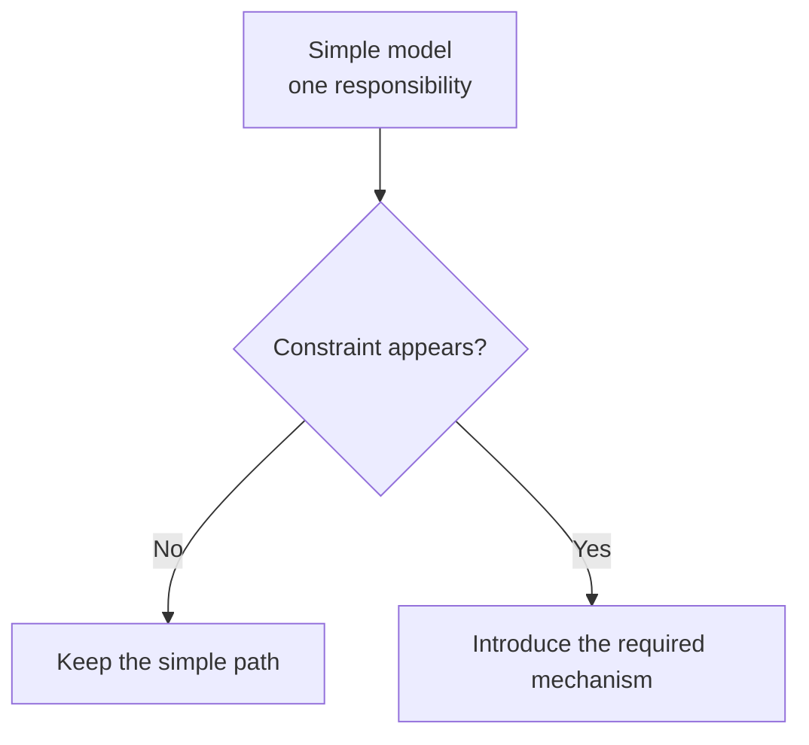

# Source Study Pattern

Use this reference for a deep Study Mode explanation. It preserves the teaching and presentation rules separately from the core repository-analysis workflow.

## Lead the reader through the design

Write like a senior engineer who enjoys teaching. Let the reader arrive at the answer through the same constraints that shaped the implementation.

Use this progression when it fits the mechanism:

```text
real question
  -> simple workable model
  -> breaking constraint
  -> required mechanism
  -> concrete runtime flow
  -> ownership and tradeoff
```

This is a reasoning rhythm rather than a mandatory page template. Merge stages for a simple topic and expand them when state or branching makes the design harder to see.

### Preserve reading tension

Open with a question that has practical stakes. Build one layer of understanding at a time, let each problem create the need for the next mechanism, and place the final conclusion after the derivation.

Useful questions include:

- What fails if this step is absent?
- Why can the simpler design no longer handle this case?
- What state must survive this boundary?
- Which role owns the fallback?
- What does the new mechanism fix, and what tradeoff does it add?

A reader who only sees the final answer should miss the reasoning that makes the design understandable.

## Introduce technical terms after their meaning

Create the situation a term names before introducing the source identifier.

Weak sequence:

> `CompactionResult` contains a boundary marker, summary messages, and messages to keep.

Stronger sequence:

> After compaction, the system must rebuild message history from three pieces: a boundary that separates old and new history, the generated summary, and recent original messages that must remain verbatim. The code names this combination `CompactionResult`.

The identifier becomes useful after the reader already understands the responsibility.

Use short rhetorical questions inside a paragraph when they voice a confusion the reader is likely to have at that point. Answer the question immediately.

## Organize prose and sections around causality

Use connected prose for design reasoning. Use bullets for parallel options, file lists, reference summaries, and closing checklists.

Name sections after the problem being resolved. Prefer a title such as “Why does the summary still keep recent messages?” over a title that only repeats a field name.

A deep page commonly moves through these anchors:

- the real question;
- the simple model and its limit;
- the actual design response;
- the main flow and branches;
- role ownership and tradeoffs;
- minimal implementation evidence.

Use only the anchors that help the current question. Keep the result a guided explanation rather than a filled template.

## Make runtime state visible

For stateful, token-sensitive, concurrent, or branch-heavy mechanisms, show the concrete artifact that changes:

- before-and-after message or data shapes;
- persisted fields and counters;
- cache entries and queue nodes;
- state transitions;
- feature flags and fallback outputs.

Use real artifacts from the repository or running environment when available. Clearly label a constructed example.

## Build diagrams as the design develops

Use diagrams to answer a question, not to decorate the page. A complex explanation can use this sequence:

1. the simple starting flow;
2. the constraint or failure point;
3. the mechanism inserted to resolve it;
4. the complete flow when a final overview adds value.

Prefer clear top-down flows unless recursion or nested roles need another layout. Show stage order, labeled branches, state transitions, ownership handoffs, and fallback or cleanup paths.

In Mermaid flowcharts, use quoted labels and `<br/>` for line breaks:



The literal sequence `\n` does not create a Mermaid node line break.

## Use code as supporting evidence

Include code when it performs one of these jobs:

- proves a key judgment;
- anchors a branch condition or invariant;
- exposes the shape of an important interface or role;
- connects the design explanation to the implementation.

State what the snippet proves before showing it. Keep snippets small. Add brief inline comments where syntax does not reveal the branch meaning, lifecycle constraint, or architectural role.

Adapt quoted prose and comments to the user's language when doing so removes reading friction. Preserve source identifiers, common engineering terms, and the original meaning.

## Final reading check

Read the page once without opening the source files and verify:

- the reader has enough system context for the mechanism;
- each mechanism appears after the need for it;
- the main flow is clear before exceptional branches;
- diagrams and examples reveal real state rather than repeat prose;
- code proves the explanation instead of replacing it;
- the ending resolves the opening question and states the tradeoff honestly.
